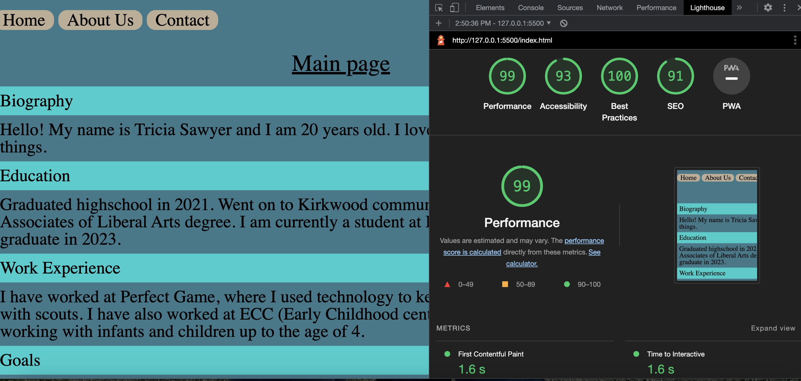

# Lab-2

## About Me

### Author: Tricia Sawyer

### Links and Resources

* Eric Meyer

### Lighthouse Accessibility Report Score

### Reflections and Comments

I enjoyed creating this about me webpage, and using javascript to create
prompts and alerts! It's really sweet!
I also created a guessing game that takes in a numeric input by prompting the
user to guess a number. It indicates through an alert, if the guess is too high or too low,
giving them four opportunities to get the correct answer.
